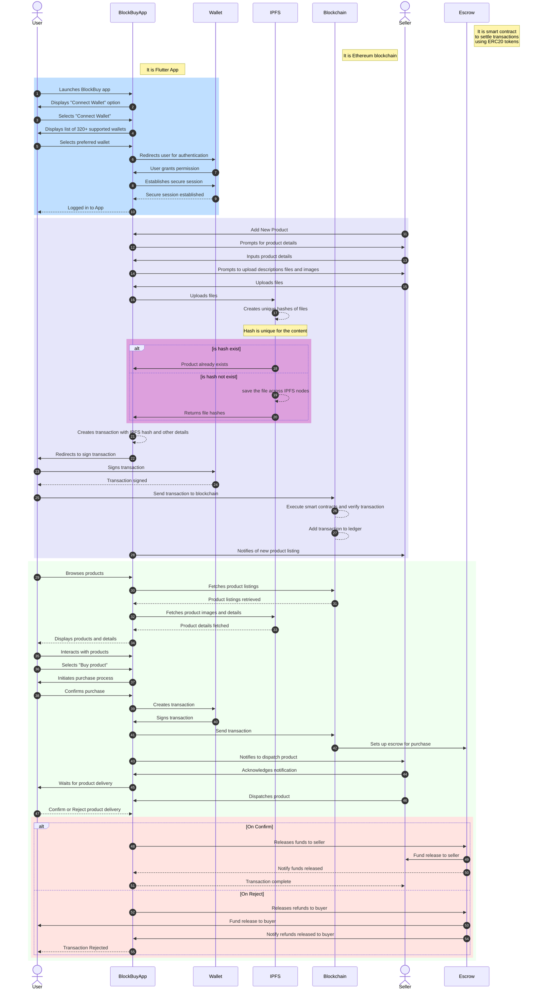

# 🌐 BlockBuy Blockchain Powered Marketplace 🛒

Welcome to BlockBuy, a blockchain-powered marketplace revolutionizing the way transactions are conducted securely and seamlessly. BlockBuy is a final year project developed by students of NCER College, Pune, under the guidance of Dipika Paranjape Mam. Meet the developers behind this project: Aniket Wagh, Nikita Sarje, and Rajlaxmi Warat.

With BlockBuy, users can enjoy the benefits of decentralization, enhanced security, and efficient transactions through a combination of cutting-edge technologies. Below, we'll dive into the various components that make up our platform's technology stack, highlighting their importance, advantages, and how they contribute to an attractive and interactive user experience.

## 🛠️ Technology Stack

### W3m (Wallet Integration)

BlockBuy leverages w3m to seamlessly connect over 300+ crypto wallets, ensuring a smooth and secure transaction process for users. This integration eliminates the need for manual wallet management, providing convenience and ease of use.

Advantages:
- 🔒 Enhanced Security: W3m employs robust encryption protocols, safeguarding users' assets and personal information.
- 🔄 Seamless Integration: Users can effortlessly link their preferred crypto wallets, streamlining the transaction process.
- ♾️ Accessibility: With support for a wide range of wallets, BlockBuy ensures inclusivity and accessibility for all users.

### IPFS Pinata (File Storage)

For storing images and large files securely, BlockBuy utilizes IPFS Pinata. This decentralized file storage solution offers reliability, scalability, and data redundancy, ensuring that users' data remains accessible and immutable.

Advantages:
- 🔗 Decentralization: IPFS Pinata distributes data across a network of nodes, reducing the risk of data loss or censorship.
- 📈 Scalability: As the platform grows, IPFS Pinata can seamlessly accommodate increasing data storage requirements without compromising performance.
- 🔐 Data Integrity: By utilizing cryptographic hash functions, IPFS Pinata verifies the integrity of stored files, mitigating the risk of tampering or corruption.

### Ethereum Blockchain (Smart Contracts)

BlockBuy harnesses the power of the Ethereum blockchain for executing smart contracts, enabling automated and trustless transactions. Through smart contracts, users can engage in secure, transparent, and immutable transactions powered by blockchain technology.

Advantages:
- 🤝 Trustless Transactions: Smart contracts eliminate the need for intermediaries, ensuring that transactions are executed as programmed without the risk of manipulation or fraud.
- 🔍 Transparency: All transaction data is recorded on the public Ethereum blockchain, providing transparency and auditability.
- ⚙️ Automation: Smart contracts enable automated execution of predefined actions based on predetermined conditions, streamlining transaction processes.

### BlockBuy Token (BBT)

The heart of the BlockBuy ecosystem, the BlockBuy Token (BBT), is an ERC-20 compliant cryptocurrency used for transactions within the marketplace. BBT facilitates fast, secure, and cost-effective transactions while incentivizing user participation and engagement.

Advantages:
- 💸 Transaction Efficiency: With BBT, users can conduct transactions quickly and affordably, avoiding high transaction fees associated with traditional payment methods.
- 🏆 Incentive Mechanism: BBT serves as an incentive for users to actively participate in the platform, fostering community engagement and loyalty.
- 🔄 Interoperability: Being ERC-20 compliant, BBT can be easily integrated with various wallets, exchanges, and decentralized applications, enhancing its usability and liquidity.

### Flutter (Frontend)

BlockBuy delivers an attractive and interactive user experience through its frontend built using Flutter. Flutter's cross-platform development framework enables the creation of visually stunning and responsive user interfaces, ensuring a seamless user experience across different devices.

Advantages:
- 📱 Cross-Platform Compatibility: Flutter allows for the development of applications that run smoothly on both iOS and Android devices, reducing development time and costs.
- 🎨 Rich User Interfaces: With Flutter's rich set of customizable widgets and animations, BlockBuy delivers a visually appealing and engaging user interface.
- 🚀 Fast Development Cycle: Flutter's hot reload feature enables developers to see changes in real-time, speeding up the development process and facilitating rapid iteration.

## 🚀 Get Started

To get started with BlockBuy and experience the future of decentralized marketplaces, follow these steps:

1. **Clone the Repository**: Clone the BlockBuy repository to your local machine.
2. **Install Dependencies**: Install all necessary dependencies for running the application.
3. **Run the Application**: Launch the BlockBuy application on your preferred device.
4. **Explore and Enjoy**: Start exploring the marketplace, conducting transactions, and engaging with the community.

## 📞 Support

For any inquiries, feedback, or assistance, please reach out to our support team at [support@blockbuy.com](mailto:support@blockbuy.com). We're here to help!

## 🤝 Contribute

Interested in contributing to BlockBuy? We welcome contributions from developers of all skill levels. Check out our [Contribution Guidelines](CONTRIBUTING.md) to get started.

## 📝 License

BlockBuy is licensed under the [MIT License](LICENSE). Feel free to use, modify, and distribute the code according to the terms of the license.

---

Thank you for choosing BlockBuy - where innovation meets convenience in the world of decentralized marketplaces! 🚀
